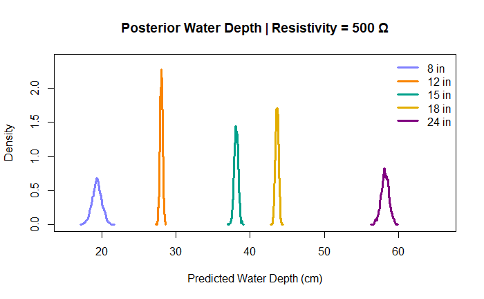

# eTape Calibration Investigation
Created by: <br/>
[A.J. Brown](mailto:ansley.brown@colostate.edu)<br/>
Agricultural Data Scientist<br/>
[CSU Agricultural Water Quality Program](waterquality.colostate.edu)

## Overview

This repository investigates the calibration consistency of Milone eTape sensors used in the **Low-Cost IoT Water Sampler (LCS)** developed by the CSU Agricultural Water Quality Program. Currently, each sensor is individually calibrated to convert its raw resistive output to water depth. However, preliminary observations suggest that for each sensor type (e.g., 8", 12", 15"), the calibration curves (slope and intercept) may be sufficiently similar to justify a unified model. This project uses **Bayesian linear regression** to quantify variability in these calibrations and assess whether type-level models could replace unit-specific calibration.

The goal is to reduce calibration burden while maintaining measurement accuracy—especially important for scale-up in field deployments.

Key Findings:
- Calibration curves vary by sensor length, not by individual sensor
- A generalized model for each sensor length type can be used, rather than individual calibrations
- This approach simplifies future deployments and reduces calibration time
- Future work could focus on developing a reference resistance value for when the device is out of water, further simplifying the calibration process

---

## Repository Structure

```bash
etape-calibration-investigation/
│
├── code/
│   └── etape-analysis.r          # Main Bayesian modeling and analysis script
│
├── data/
│   ├── etape_data.csv            # Main calibration dataset
│   └── etape_data.xlsx           # Original spreadsheet version (optional)
│
├── docs/
│   └── Standard eTape Manual.pdf # Manufacturer datasheet with sensor specs
│
├── figs/                         # Output plots (generated by code)
│
├── .gitattributes
├── .gitignore
├── LICENSE
└── README.md                     # This file
```

## Methodology
Starting in 2023, the CSU Agricultural Water Quality Program has been calibrating eTape sensors using a standardized protocol. The calibration involves measuring the resistance of the sensor at known water depths (i.e., from 1 inch to the max depth of the individual eTape), which are manually recorded, then regressed to derive a linear relationship between resistance and water depth for each eTape sensor:

$$ Water Depth = \alpha + \beta \cdot \text{Resistivity} $$

This project will utilize a generalized linear model (GLM) framework to analyze the all calibration data simultanously. The model will include:
- **Response Variable**: Water depth (in cm)
- **Predictor Variable**: Sensor resistivity (in ohms)
- **Group Variable**: eTape model (to account for differing response characteristics across sensor types)

### Statistical Approach

#### Generalized Linear Model

We use a **Bayesian generalized linear model (GLM)** to relate water depth (`water_depth_inch`) to the measured resistance (`resistivity_ohm`) from Milone eTape sensors. The slope, intercept, and residual variance are allowed to vary by `etape_length` (e.g., 8", 12", 15"), which corresponds to the model of the sensor used. The model was fit using the [`rethinking` package in R](https://github.com/rmcelreath/rethinking).

---


```
depth_i ~ Normal(mu_i, sigma_L)

mu_i = alpha_L + beta_L * resistivity_i
```

Where:

- `depth_i` is the known water depth (in inches) for observation `i`
- `resistivity_i` is the resistance (in ohms) from the eTape sensor
- `alpha_L` is the intercept for eTape length group `L`
- `beta_L` is the slope for group `L`
- `sigma_L` is the residual standard deviation for group `L`

---

**Priors:**
Priors are set based on prior knowledge of eTape sensor behavior and individual sensor calibration data. The slope and intercept values are centered around typical values observed in previous calibrations:

| Sensor Length (`etape_length`) | Typical Intercept (`alpha_L`) | Typical Slope (`beta_L`) |
| ------------------------------ | ----------------------------- | ------------------------ |
| 08 inch                        | \~28                          | -0.017                  |
| 12 inch                        | \~32                          | -0.017                  |
| 15 inch                        | \~40                          | -0.017                  |
| 18 inch                        | \~48                          | -0.017                  |
| 12 inch                        | \~61                          | -0.017                  |

```
alpha_L ~ Normal(aPrior, 5)         # Centered around typical intercepts
beta_L  ~ Normal(-0.0017, 0.0005)  # Reflecting observed slope
sigma_L ~ Exponential(1)
```

Where:
```
aPrior <- c(28, 32, 40, 48, 61)  # Typical intercepts for each sensor length
```

## Data Description
The data for this analysis are stored in `data/etape_data.csv`. It contains calibration data for multiple eTape sensors, including their resistive outputs and corresponding water manually measured water depths. 

The file `data/etape_data.csv` contains raw calibration data for multiple eTape sensors. Each row corresponds to a depth measurement with the associated sensor reading.

| Column Name         | Description                                                             |
|---------------------|-------------------------------------------------------------------------|
| `year`              | Year of the test                                                        |
| `water_depth_inch`  | Known water depth during calibration (in inches)                        |
| `resistivity_ohm`   | Measured resistance from eTape sensor (in ohms)                         |
| `etape_ID`          | Unique identifier for each physical eTape sensor                        |
| `etape_length`      | Nominal length of the eTape sensor (e.g., 15 for 15-inch sensor)        |
| `good/bad`          | Quality flag for measurement ('good' or 'bad')                          |
| `notes`             | Optional notes regarding conditions or sensor status                    |


## Milone eTape Sensor Details

As documented in the official datasheet (`docs/Standard eTape Manual.pdf`), the eTape sensor:

- Is a solid-state resistive fluid level sensor
- Outputs **resistance inversely proportional to fluid level**
- Has a resolution < 0.01" (0.25 mm)
- Typical output range:
  - 8" sensor: 400–1500 Ω ±20%
  - 12" sensor: 400–2000 Ω ±20%
  - 15" sensor: ~400–2500 Ω (field-observed)
  - Resistance gradient: ~150 Ω/inch or 59.06 Ω/cm

For best results, the sensor must be kept vertically straight and immersed evenly, as outlined in the datasheet.

## Results

> [!NOTE]
> Simulated data was created and used to verify the model structure and results. The actual calibration data is used for final analysis. Simulated data is include in the code for reference, but the results presented here are based on real calibration data.

Below are the results of the Bayesian analysis, including posterior distributions for the intercepts (alpha) and slopes (beta) of the calibration curves for each eTape sensor length.

Summary table of all calibrated parameters: <br/>

**Index number key:** <br/>

| 1 = 8 inch | 2 = 12 inch | 3 = 15 inch | 4 = 18 inch | 5 = 24 inch |
|-----------|--------|-------|-------|-------|

| Parameter | Mean   | SD    | 5.5%  | 94.5% | Histogram                  |
|-----------|--------|-------|-------|-------|----------------------------|
| alpha[1]  | 28.04  | 0.91  | 26.59 | 29.51 | ▁▁▁▂▅▇▇▅▃▁▁▁▁           |
| alpha[2]  | 35.98  | 0.27  | 35.55 | 36.42 | ▁▁▂▃▇▇▃▁▁▁              |
| alpha[3]  | 46.54  | 0.37  | 45.95 | 47.13 | ▁▁▂▃▇▇▇▅▂▁▁▁            |
| alpha[4]  | 52.06  | 0.29  | 51.62 | 52.52 | ▁▁▁▃▇▇▅▂▁▁▁             |
| alpha[5]  | 65.97  | 0.62  | 64.99 | 66.94 | ▁▁▁▃▇▇▃▁▁              |
| beta[1]   | -0.017 | 0.00  | -0.02 | -0.02 | ▁▁▃▇▇▂▁▁               |
| beta[2]   | -0.016 | 0.00  | -0.02 | -0.02 | ▁▁▁▁▂▃▅▇▇▅▃▂▁▁▁        |
| beta[3]   | -0.017 | 0.00  | -0.02 | -0.02 | ▁▁▁▂▃▇▇▇▅▃▂▁▁▁         |
| beta[4]   | -0.017 | 0.00  | -0.02 | -0.02 | ▁▁▁▂▅▇▇▃▂▁▁▁           |
| beta[5]   | -0.016 | 0.00  | -0.02 | -0.02 | ▁▁▂▃▇▇▃▁▁▁▁            |
| sigma_L   | 2.38   | 0.05  | 2.30  | 2.46  | ▁▁▃▇▅▁▁▁               |


### Figure 1: Intercept results: <br/>
[](figs/intercept_results_real.png)

### Figure 2: Slope results: <br/>
[](figs/slope_results_real.png)

### Figure 3: Using the generative model to predict depth at a resistance of 500 ohms: <br/>
[](figs/500ohm_pred.png)

Summary table of posterior predictive results at 500 ohms:
| eTape Length | Mean     | SD        | 2.5%     | 97.5%    |
|--------------|----------|-----------|----------|----------|
| 8            | 19.37050 | 0.6432015 | 18.09380 | 20.61520 |
| 12           | 28.02889 | 0.1815699 | 27.65329 | 28.38674 |
| 15           | 38.11105 | 0.2739453 | 37.58863 | 38.63055 |
| 18           | 43.60274 | 0.2165759 | 43.18235 | 44.00805 |
| 24           | 58.15743 | 0.5262453 | 57.10703 | 59.21239 |


## Conclusion
Results indicate that linear model parameters (slope and intercept) vary by eTape sensor length, but the parameter differences are not substantial between individual etape units. This suggests a a set of generalized calibration parameters could be used for each sensor length type, rather than individual calibrations for each unit, saving time and effort in future deployments.

Below is the summary table containing the average slope and intercept values for each eTape sensor length, which can be used for future calibrations:

| eTape Length (inches) | Intercept (α) | Slope (β)       |
|-----------------------|---------------|-----------------|
| 8                     | 28.0378353    | -0.01726096     |
| 12                    | 35.9807504    | -0.01590957     |
| 15                    | 46.540297     | -0.01682064     |
| 18                    | 52.0602068    | -0.01690116     |
| 24                    | 65.97030975   | -0.01560485     |

## Future Work
Due to the similarity of the slope parameters across sensor lengths, future work could focus on developing a reference resitance value for when the device is out of water. Subtracting this reference value from the raw resistance reading could simplify the calibration process further by eliminating the need for an intercept term in the model. This would allow for a single slope value to be applied across all sensor lengths, further streamlining the calibration process. However, this approach would require that the etape firmware be modified to allow the user to set the reference resistance value and store it for future readings.